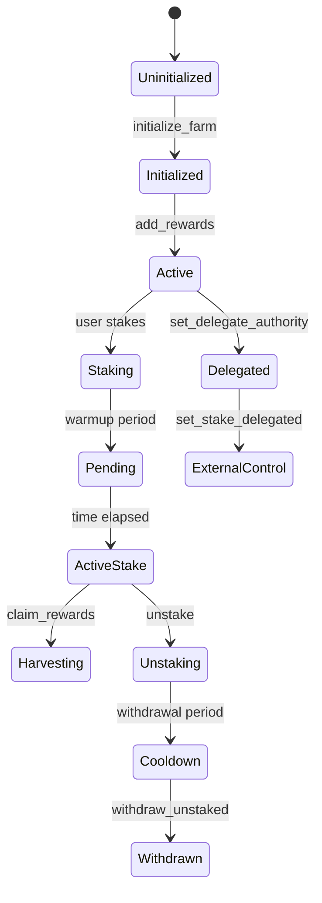

# Phase 1: Discovery and Scoping Report

## Executive Summary
KFarms is a Solana-based staking/farming protocol that supports multiple reward tokens with time-based emission schedules. The protocol includes a delegated staking mechanism that allows external programs to set user stakes directly.

## Critical Components Identified

### 1. Core Instructions
- **`stake`**: Deposits tokens with optional warmup period
- **`unstake`**: Withdraws tokens with optional cooldown period  
- **`set_stake_delegated`**: External point setter for delegated farms
- **`harvest_reward`**: Claims accumulated rewards
- **`refresh_farm`/`refresh_user_state`**: Updates reward accumulation
- **`initialize_farm_delegated`**: Creates farms with external stake control
- **`update_emission`**: Modifies reward rates

### 2. Key Accounts & PDAs
```
- GlobalConfig: Protocol-wide configuration
- FarmState: Pool state with reward info
- UserState: Per-user staking position
- farm_vaults_authority: PDA controlling vaults
- reward_vault: Token account for each reward
- farm_vault: Main staking token vault
```

### 3. State Machine Mapping



### 4. Token Flow Analysis
- **Inflows**: stake deposits, reward additions
- **Outflows**: unstake withdrawals, reward harvests, treasury fees
- **Internal**: pending → active transitions, slashing penalties

### 5. Critical Math Components
- **Reward accumulation**: Uses scaled decimal (10^18) arithmetic
- **Point calculation**: `points = stake * multiplier + external_points`
- **Distribution**: `reward_per_share += rewards / total_active_stake`
- **User earnings**: `(points * reward_per_share - debt) / scale`

## Risk Areas Identified

### High Priority
1. **Delegated stake mechanism** - External control without custody proof
2. **Reward per share calculation** - Division by zero when total_stake = 0
3. **Decimal scaling** - Multiple precision conversions
4. **Time-based transitions** - Slot vs timestamp usage

### Medium Priority  
1. Treasury fee calculation and distribution
2. Warmup/cooldown period enforcement
3. Slashing penalty calculations
4. Multi-reward token accounting

## Next Steps
- Phase 2: Mathematical specification and invariant definition
- Phase 3: External points threat modeling
- Phase 4: Solana-specific security review