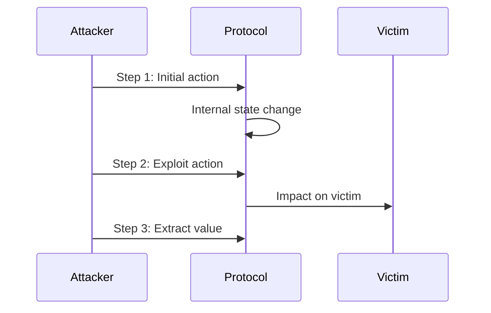

# Finding Report: [VULNERABILITY NAME]

## Executive Summary

**Severity**: 🔴 CRITICAL / 🟠 HIGH / 🟡 MEDIUM / 🟢 LOW

**Impact**: Fund Theft / Insolvency / DoS / Manipulation / Governance Attack

**Likelihood**: High / Medium / Low

**CVSS Score**: [X.X] ([CVSS Vector])

**Status**: 🔓 Confirmed / ⚠️ Suspected / ✅ Fixed

## Vulnerability Details

### Description
[Clear, concise description of the vulnerability in 2-3 sentences]

### Technical Root Cause
[Detailed technical explanation of why this vulnerability exists, including specific code references]

### Location
- **File**: `src/instructions/[file].rs`
- **Function**: `[function_name]`
- **Lines**: L[XX]-L[YY]

## Attack Scenario

### Prerequisites
1. [Condition 1 that must be true]
2. [Condition 2 that must be true]
3. [Required attacker capabilities]

### Attack Steps
1. **Setup**: [Initial setup required]
2. **Execution**: [Main attack execution]
3. **Exploitation**: [How value is extracted]
4. **Cleanup**: [Covering tracks if applicable]

### Attack Diagram


## Proof of Concept

### PoC Code
```rust
// Simplified PoC demonstrating the vulnerability
#[test]
fn test_exploit() {
    // Setup
    let attacker = create_attacker();
    let victim = create_victim_with_funds(1000);
    
    // Attack
    attacker.execute_malicious_action();
    
    // Verify exploit success
    assert!(attacker.balance > 0);
    assert!(victim.balance < 1000);
}
```

### PoC Output
```
[*] Initializing exploit...
[*] Victim balance before: 1000 tokens
[*] Executing attack...
  [1] Step 1 completed
  [2] Step 2 completed
  [3] Value extracted: 500 tokens
[*] Attack successful!
[*] Attacker balance: 500 tokens
[*] Victim balance: 500 tokens
```

### Live Demo
- Transaction: [Solana Explorer Link]
- Block: [Block Number]
- Cost: [Transaction Cost]

## Impact Analysis

### Direct Impact
- **Financial Loss**: Up to [X] tokens can be stolen
- **Affected Users**: [All users / Specific user group]
- **Protocol State**: [State corruption details]

### Indirect Impact
- **Reputation Damage**: High - exploits of this nature severely damage trust
- **Cascade Effects**: [Secondary vulnerabilities enabled]
- **Recovery Difficulty**: [Easy/Medium/Hard] - [Explanation]

### Economic Impact Calculation
```
Maximum Extractable Value (MEV):
- Per transaction: [X] tokens
- Per block: [Y] tokens  
- Total at risk: [Z] tokens (current TVL)

Attack Cost:
- Gas fees: ~[X] SOL
- Flash loan fees: ~[Y]%
- Net profit: ~[Z] tokens
```

## Affected Code

### Vulnerable Code
```rust
// src/instructions/vulnerable_function.rs:L50-L65
fn vulnerable_function(ctx: Context<VulnerableContext>, amount: u64) -> Result<()> {
    let pool = &mut ctx.accounts.pool;
    
    // VULNERABILITY: No check for condition X
    pool.total_points += amount;  // <- Overflow possible
    
    // VULNERABILITY: State updated before validation
    let rewards = calculate_rewards(pool.total_points);
    
    // Transfer happens after state change
    transfer_tokens(rewards)?;
    
    Ok(())
}
```

### Root Cause Analysis
The vulnerability exists because:
1. **Missing Validation**: [Specific validation missing]
2. **Incorrect Ordering**: [Operations in wrong order]
3. **Unsafe Math**: [Unchecked arithmetic operations]

## Remediation

### Recommended Fix
```rust
// src/instructions/vulnerable_function.rs:L50-L65 (FIXED)
fn secure_function(ctx: Context<SecureContext>, amount: u64) -> Result<()> {
    let pool = &mut ctx.accounts.pool;
    
    // FIX 1: Add validation
    require!(amount <= MAX_AMOUNT, Error::AmountTooLarge);
    
    // FIX 2: Use checked math
    pool.total_points = pool.total_points
        .checked_add(amount)
        .ok_or(Error::Overflow)?;
    
    // FIX 3: Calculate before state change
    let rewards = calculate_rewards(pool.total_points)?;
    
    // FIX 4: Validate before transfer
    require!(rewards <= pool.available_rewards, Error::InsufficientRewards);
    
    // Transfer only after all checks
    transfer_tokens(rewards)?;
    
    Ok(())
}
```

### Implementation Steps
1. **Immediate**: Deploy hotfix to pause affected functionality
2. **Short-term**: Implement the recommended fix
3. **Long-term**: Add comprehensive test coverage
4. **Monitoring**: Add on-chain monitoring for similar patterns

### Additional Safeguards
- [ ] Add circuit breaker for anomalous activity
- [ ] Implement rate limiting
- [ ] Add multisig requirement for sensitive operations
- [ ] Deploy monitoring bot for attack detection

## Testing

### Unit Tests Required
```rust
#[test]
fn test_overflow_prevention() { /* ... */ }

#[test]
fn test_validation_enforcement() { /* ... */ }

#[test]
fn test_state_consistency() { /* ... */ }
```

### Integration Tests Required
- Fuzzing with random inputs
- Property-based testing for invariants
- Differential testing against reference model

### Regression Tests
```rust
#[test]
fn test_no_regression_vulnerability_x() {
    // Ensure the specific attack vector is blocked
    let result = attempt_exploit();
    assert!(result.is_err());
    assert_eq!(result.unwrap_err(), Error::ValidationFailed);
}
```

## References

### Similar Vulnerabilities
- [CVE-XXXX-YYYY]: Similar overflow in Protocol X
- [Audit Report Y]: Page 23, Finding #5
- [Immunefi Bug #Z]: $1M bounty for similar issue

### Documentation
- [Solana Docs]: Best practices for arithmetic
- [Anchor Book]: Security considerations
- [OWASP]: Integer overflow prevention

### Tools Used
- Fuzzer: Custom property-based fuzzer
- Static Analysis: Soteria, Sec3
- Manual Review: 40 hours
- Differential Testing: Reference model comparison

## Disclosure Timeline

| Date | Event |
|------|-------|
| 2024-01-15 | Vulnerability discovered |
| 2024-01-16 | PoC developed and verified |
| 2024-01-17 | Reported to team via secure channel |
| 2024-01-18 | Team acknowledged receipt |
| 2024-01-20 | Fix developed and tested |
| 2024-01-22 | Fix deployed to mainnet |
| 2024-01-25 | Public disclosure |

## Severity Justification

Using CVSS v3.1:
- **Attack Vector**: Network (AV:N)
- **Attack Complexity**: Low (AC:L)
- **Privileges Required**: None (PR:N)
- **User Interaction**: None (UI:N)
- **Scope**: Changed (S:C)
- **Confidentiality**: High (C:H)
- **Integrity**: High (I:H)
- **Availability**: High (A:H)

**CVSS Score**: 10.0 (Critical)

## Bounty Recommendation

Based on the impact and Immunefi's severity classification:
- **Category**: Critical - Direct fund theft
- **Funds at Risk**: $[X]M (current TVL)
- **Recommended Bounty**: $[Y]K - $[Z]K (10% of funds at risk)

---

**Report Prepared By**: [Auditor Name]
**Date**: [Date]
**Signature**: [Digital Signature]